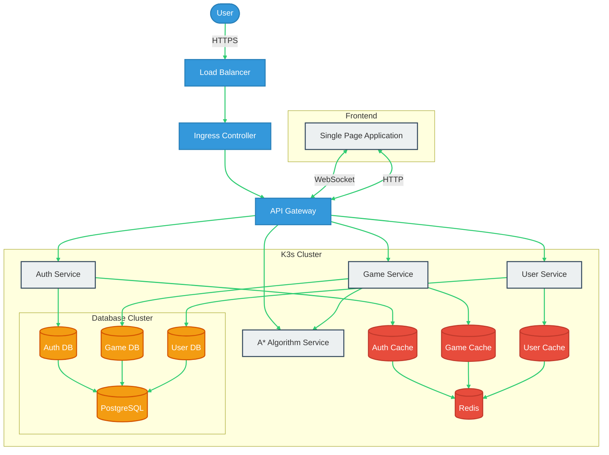

# Trailblazer

The **Trailblazer** project is designed to create an interactive web application that allows users to build a canvas, draw obstacles, and observe an object navigate from a starting point to an endpoint using the A* algorithm. While the focus is on delivering an engaging user experience, the primary aim of this project is to enhance learning and deepen understanding of web application development and algorithm implementation.

## Goal Architecture

## Timeline

#### **1. Project Setup and Planning (1-2 days)**  
- **Key Tasks:**
  - Create the project repository
  - Set up virtual machines (VMs) and k3s cluster for Kubernetes
  - Configure the development environment and define the project structure
  - Write initial documentation (README, etc.)

---

#### **2. Backend Services Development (2-3 weeks)**  
a. **User Service (3-4 days)**  
- Implement basic CRUD operations for user management.
- Set up a PostgreSQL database connection.
- Write unit tests and create a Dockerfile for deployment.
  
b. **Auth Service (2-3 days)**  
- Implement user authentication using JWT tokens.
- Write unit tests and create deployment files for Kubernetes.

c. **Game Service (4-5 days)**  
- Manage game state and provide endpoints for game interactions.
- Ensure smooth game logic and store user actions.
- Write unit tests, create a Dockerfile, and deployment YAML.

d. **Astar Algorithm Service (3-4 days)**  
- Implement the A* pathfinding algorithm as a microservice.
- Expose an API for pathfinding requests.
- Write unit tests, create Dockerfiles, and deployment configurations.

e. **API Gateway (2-3 days)**  
- Set up routing between backend services via API Gateway.
- Implement request and response transformation if necessary.
- Prepare Docker and deployment YAML for the gateway.

---

#### **3. Frontend Development (2-3 weeks)**  
- Set up the frontend using a framework like Preact.
- Implement user authentication UI for login and registration.
- Build the interactive game canvas with drawing tools for obstacle creation.
- Implement game logic and visualize the A* algorithm in action.
- Style the application using Tailwind CSS.

---

#### **4. Integration and Testing (1-2 weeks)**  
- Integrate the frontend with backend services.
- Perform end-to-end testing to ensure the system works smoothly.
- Debug and optimize for performance improvements.

---

#### **5. Kubernetes Deployment Setup (3-4 days)**  
- Create Kubernetes resources such as Ingress and Services.
- Set up monitoring and logging solutions for the application.
- Deploy the application in the local k3s cluster and test.

---

#### **6. Documentation and Cleanup (2-3 days)**  
- Write detailed deployment documentation.
- Clean up codebase and remove unnecessary development artifacts.
- Update README and ensure all documentation is current.

---

#### **7. Final Testing and Launch Preparation (2-3 days)**  
- Perform a final round of testing to ensure the app is stable.
- Prepare a launch checklist and plan for the release.
- Set up post-launch monitoring and support strategies.

---

Total estimated time: 6-8 weeks